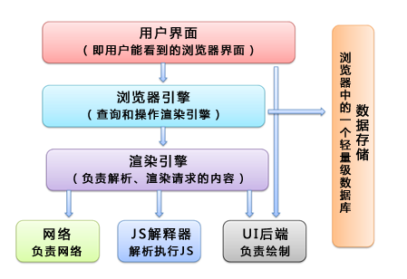
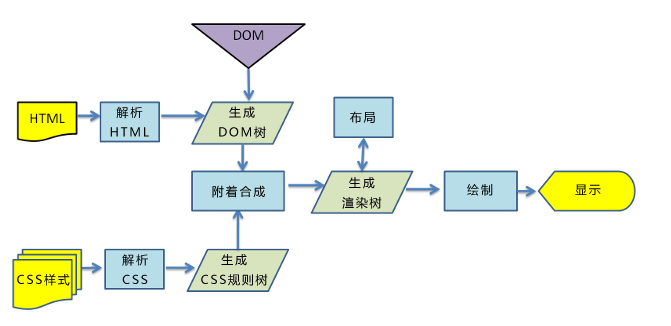

# CSS 渲染流程

**浏览器主要结构**

## 渲染路径

主要包括以下几步：

1. 解析 HTML 生成 DOM 树。

   > 当浏览器接收到服务器响应来的 HTML 文档后，会遍历文档节点，生成 DOM 树。  
   > 需要注意的是，DOM 树的生成过程中可能会被 CSS 和 JS 的加载执行阻塞。

1. 解析 CSS 生成 CSSOM 规则树。

   > 浏览器解析 CSS 文件并生成 CSS 规则树，每个 CSS 文件都被分析成一个 StyleSheet 对象，每个对象都包含 CSS 规则。CSS 规则对象包含对应于 CSS 语法的选择器和声明对象以及其他对象。

1. 将 DOM 树与 CSSOM 规则树合并在一起生成渲染树。

   > 通过 DOM 树和 CSS 规则树我们便可以构建渲染树。浏览器会先从 DOM 树的根节点开始遍历每个可见节点。对每个可见节点，找到其适配的 CSS 样式规则并应用。
   > 渲染树构建完成后，每个节点都是可见节点并且都含有其内容和对应规则的样式

1. 遍历渲染树开始布局，计算每个节点的位置大小信息。

   > 布局阶段会从渲染树的根节点开始遍历，然后确定每个节点对象在页面上的确切大小与位置，布局阶段的输出是一个盒子模型，它会精确地捕获每个元素在屏幕内的确切位置与大小。

1. 将渲染树每个节点绘制到屏幕。
   > 在绘制阶段，遍历渲染树，调用渲染器的 paint()方法在屏幕上显示其内容。渲染树的绘制工作是由浏览器的 UI 后端组件完成的。
