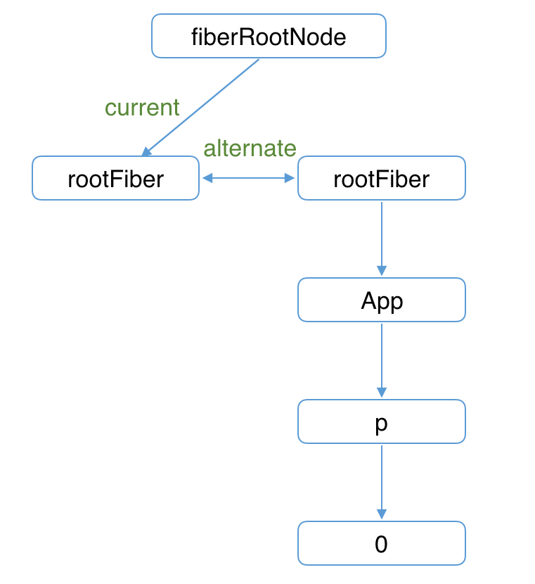
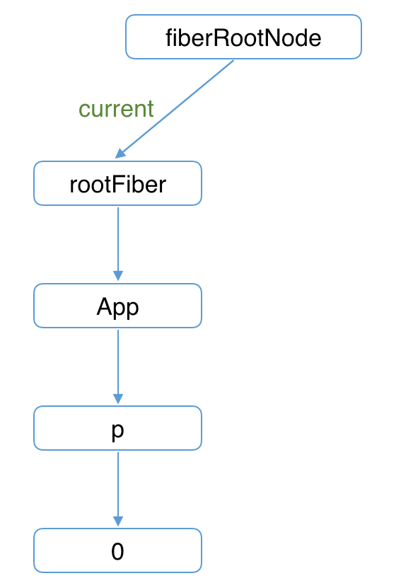
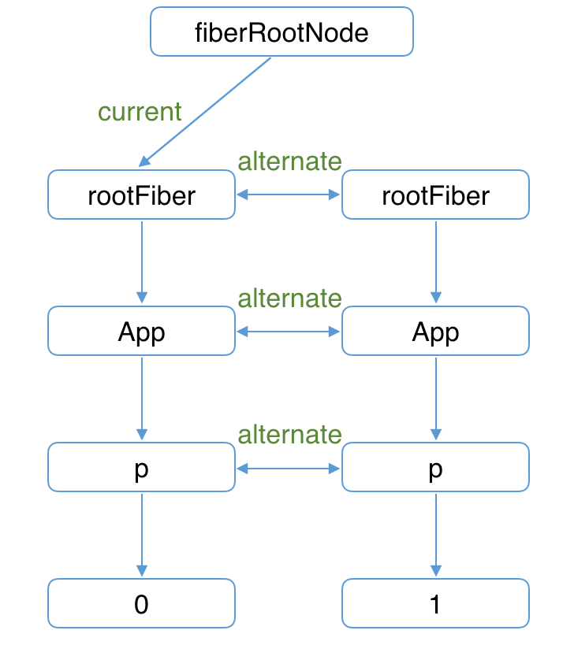

# 状态更新流程

**触发更新的几种方式：**
* ReactDOM.render
* this.setState
* this.forceUpdate
* useState
* useReducer

## fiber双缓存
在React中最多会同时存在两棵Fiber树。当前屏幕上显示内容对应的Fiber树称为current Fiber树，正在内存中构建的Fiber树称为workInProgress Fiber树。
两个Fiber树的Fiber节点通过alternate相互引用。
> alternate: 代替者; 代理人; 候补者;

应用根节点(fiberRootNode)的current指针，指向current Fiber树

## 首次渲染

1. 首次执行ReactDOM.render  会创建fiberRootNode和rootFiber

2. 接下来进入render阶段，根据巨剑返回的JSX在内存中依次创建Fiber节点并构建Fiber树，被称为workInProgress Fiber树。
**在构建workInProgress Fiber树时，会尝试复用current Fiber树内的属性**

3. 将构建完的workInProgress Fiber树在commit阶段渲染到页面
渲染完后fiberRootNode的current指针指向workInProgress Fiber使其变为current Fiber树

## update时

1. 触发更新后，会构建一颗新的workInProgress Fiber树，可以复用current Fiber树对应的节点数据（这个阶段就是diff算法）
> 有的节点被打上了effectTag的标记，有的没有，而在commit阶段时要遍历所有包含effectTag的Fiber来执行对应的增删改，那我们还需要从Fiber树中找到这些带effectTag的节点嘛，答案是不需要的，这里是以空间换时间，在这个过程中遇到了带effectTag的节点，会将这个节点加入一个叫effectList中,所以在commit阶段只要遍历effectList就可以了（rootFiber.firstEffect.nextEffect就可以访问带effectTag的Fiber了）

2. workInProgress Fiber树在commit阶段渲染到页面

**渲染完后fiberRootNode的current指针指向workInProgress Fiber使其变为current Fiber树**

---
QS:
1. rootFiber节点具体实现
2. 节点增删改查的effectTag是如何标记，dom更新的顺序是如何执行的
